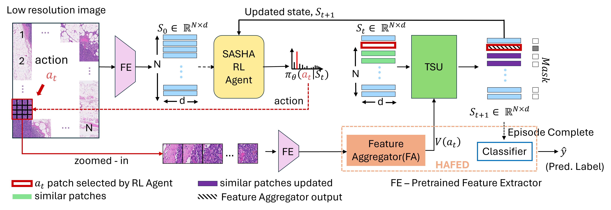
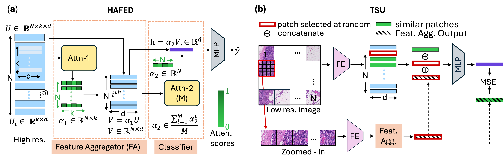

# SASHA - Sequential Attention-based Sampling for Histopathological Analysis





## Paper Link 

Available at : https://arxiv.org/abs/2507.05077

## Requirements

To install requirements:

```setup
conda create --name <env> --file conda-packages.txt
```

## Training

To train the model(s) in the paper, run this command:

STEP 1

First step to process is to WSI and segment it and remove the region where the tissue sample for
a patch is less than some threshold.

For CAMELYON16 dataset
```train
python step1_create_patches.py --source SOURCE_DIR --save_dir SAVE_DIR --extension tif --patch_level 3
```

FOR TCGA-NSCLC dataset
```train
python step1_create_patches.py --source SOURCE_DIR --save_dir SAVE_DIR --extension svs --patch_level 2
```

STEP 2
This step handles feature extraction.
There are two modes of operation:

1. If `extract_high_res_features` is set to `True`, the feature extractor will generate features for both high-resolution and low-resolution patches.

2. If `extract_high_res_features` is set to `False`, features will be extracted only for low-resolution patches.


For extraction both high resolution and low resolution together
```train
python step2_extract_features.py --dataset_name camelyon16 --data_h5_dir SAVE_DIR_PATH_FROM_PATCH_CREATION --data_slide_dir WSI_IMAGES_DIR --slide_ext .tif --csv_path dataset_csv/camelyon16/camelyon16.csv --feat_dir FEAT_DIR_TO_SAVE --batch_size 32 --extract_high_res_features True --patch_level_low_res 3 --patch_level_high_res 1
```

For only low resolution
```train
python step2_extract_features.py --dataset_name camelyon16 --data_h5_dir SAVE_DIR_PATH_FROM_PATCH_CREATION --data_slide_dir WSI_IMAGES_DIR --slide_ext .tif --csv_path dataset_csv/camelyon16/camelyon16.csv --feat_dir FEAT_DIR_TO_SAVE --batch_size 512 --extract_high_res_features False --patch_level_low_res 3 --patch_level_high_res 1
```

STEP 3 

This script is used to train the models required to obtain the Feature Aggregator and Classifier components of HAFED.

These trained models are utilized in the subsequent stage of the pipeline.

Model Architecture:
- Feature Aggregator: Input shape (k × d) → Output shape (d)
- Classifier: Input shape (N × d) → Output: predicted class probabilities (ŷ)

For training of HAFED
```train
python step3_WSI_classification_HAFED.py --config config/camelyon_config.yml --seed 4 --arch hafed --exp_name DEBUG --log_dir LOG_DIR
```

STEP 4 

Once the HAFED model has been trained using all high-resolution patches,
the workflow proceeds as follows:

- Input: (N × k × d)
- Intermediate output (after feature aggregation): (N × d)

```train
python step4_extract_intermediate_features.py --config config/camelyon_config.yml --seed 4 --arch hafed --ckpt_path CKPT_PATH --output_path OUTPUT_PATH
```

STEP 5

The primary objective is to propagate feature information from selected patches to their similar counterparts,
based on a cosine similarity threshold.


```train
python step5_tsu_training.py --config config/camelyon_tsu_config.yml --seed 4 --arch hafed --log_dir LOG_DIR
```

STEP 6 

This script initiates the training of the RL Agent component after separately training the HAFED,
which includes the Feature Aggregator, Classifier and TSU.

```train
python step6_rl_training.py --config config/camelyon_rl_config.yml --seed 4  --log_dir LOG_DIR
```


## Evaluation

To evaluate for SASHA-0.1 and SASHA-0.2, with utilizing the features extracted in STEP 2 and STEP4:

```eval
python step7_inference.py --config config_prince/camelyon_sasha_inference.yml --seed 4
```

Evaluate model with feature extraction 

```eval
python step7_inference_with_fe.py --config config/camelyon_sasha_inference_with_fe.yml --seed 4 --save_dir SAVE_DIR
```

Note : For TCGA-NSCL dataset similar config files are present in config/ folder.


## Results

Our model achieves the following performance on CAMELYON16 (C16) and TCGA-NSCLC (TCGA) dataset


| Sampling | Method    | Accuracy (C16)    | AUC (C16)         | F1 (C16)          | Accuracy (TCGA)   | AUC (TCGA)        | F1 (TCGA)         |
| -------- | --------- | ----------------- | ----------------- | ----------------- |-------------------|-------------------|-------------------|
| 100%     | **HAFED** | **0.963 ± 0.008** | **0.980 ± 0.003** | **0.951 ± 0.011** | **0.923 ± 0.011** | **0.966 ± 0.015** | **0.925 ± 0.010** |
| 10%      | **SASHA-0.1** | **0.901 ± 0.021** | **0.918 ± 0.014** | **0.856 ± 0.031** | **0.897 ± 0.023** | **0.956 ± 0.023** | **0.898 ± 0.024** |
| 20%      | **SASHA-0.2** | **0.953 ± 0.017** | **0.979 ± 0.008** | **0.937 ± 0.024** | **0.912 ± 0.010** | **0.963 ± 0.014** | **0.914 ± 0.011** |

## Contributing

Creative Commons Attribution-NonCommercial 4.0 International

This work is licensed under the Creative Commons Attribution-NonCommercial 4.0 International License.  
To view a copy of this license, visit https://creativecommons.org/licenses/by-nc/4.0/.

You are free to:
- Share — copy and redistribute the material in any medium or format
- Adapt — remix, transform, and build upon the material

Under the following terms:
- Attribution — You must give appropriate credit, provide a link to the license, and indicate if changes were made.
- NonCommercial — You may not use the material for commercial purposes.
- No additional restrictions — You may not apply legal terms or technological measures that legally restrict others from doing anything the license permits.

For more information, see https://creativecommons.org/licenses/by-nc/4.0/