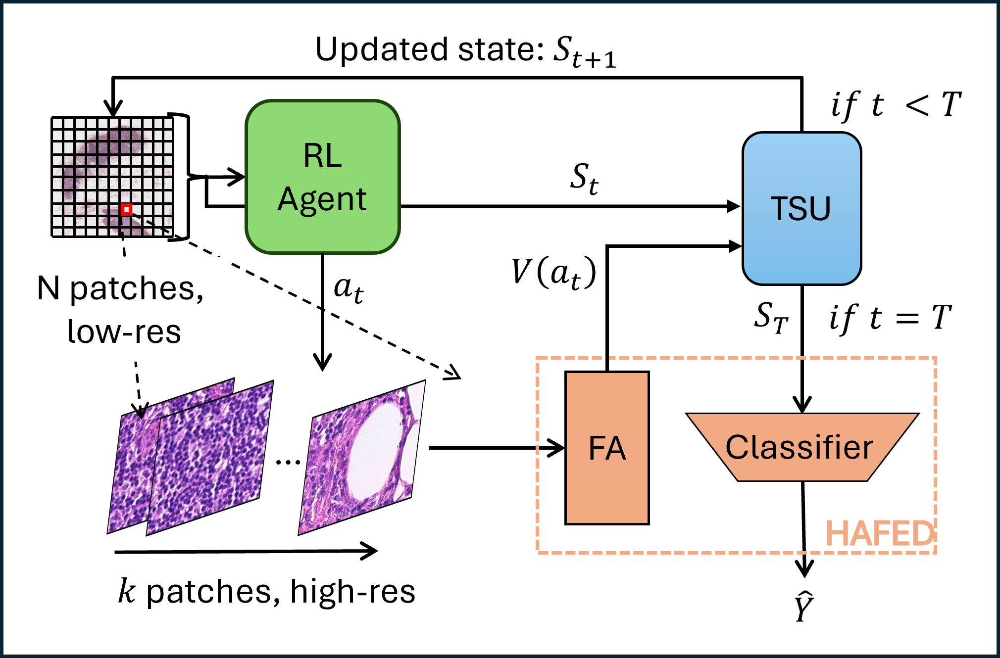

# SASHA - Sequential Attention-based Sampling for Histopathology Analysis

Deep neural networks are increasingly applied for automated histopathology. 
Yet, whole-slide images (WSIs) are often acquired at gigapixel sizes, rendering it 
computationally infeasible to analyze them entirely at high resolution. 
Diagnostic labels are largely available only at the slide-level, 
because expert annotation of images at a finer (patch) level is both 
laborious and expensive. Moreover, regions with diagnostic information typically occupy 
only a small fraction of the WSI, making it inefficient to examine the entire 
slide at full resolution. Here, we propose SASHA -- *S*equential *A*ttention-based *S*ampling for *H*istopathological 
*A*nalysis -- a deep reinforcement learning approach for efficient analysis of histopathological images. 
First, SASHA learns informative features with a lightweight hierarchical, attention-based multiple instance 
learning (MIL) model. 
Second, SASHA samples intelligently and zooms selectively into a small fraction (10-20\%) of high-resolution patches, 
to achieve reliable diagnosis. We show that SASHA matches state-of-the-art methods that analyze the WSI fully at 
high-resolution, albeit at a fraction of their computational and memory costs. 
In addition, it significantly outperforms competing, sparse sampling methods. 
We propose SASHA as an intelligent sampling model for medical imaging challenges that involve automated diagnosis 
with exceptionally large images containing sparsely informative features.

## 👨‍💻 Authors

- [Tarun Gogisetty](https://github.com/GT657)
- [Naman Malpani](https://github.com/Naman2399)
- Prof. Sridharan Devarajan
- Prof. Gugan Thoppe

## Overview 

## Results

